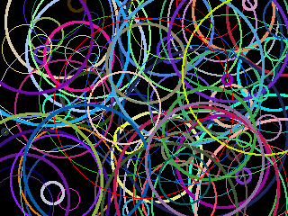

# PyRT - The Python Raytracer #

[](https://travis-ci.org/martinchristen/pyRT) [](https://gitter.im/pyRT/pyRT-dev?utm_source=badge&utm_medium=badge&utm_campaign=pr-badge)  [](https://github.com/martinchristen/pyrt/issues) [](https://codeclimate.com/github/martinchristen/pyRT) [](https://landscape.io/github/martinchristen/pyRT/master) [](https://github.com/martinchristen/pyRT/blob/master/LICENSE.md)


**PyRT** (pronounced _pirate_) is a raytracer/image generator written in Python 3.x. This project is mainly done with the following in mind:

  * Server-side rendering / cloud based rendering
  * Ray Tracing in the Jupyter Notebook
  * Teaching Ray Tracing
  * Exploring ray tracing concepts for geo data using Python.
  * Rendering geo data, including large point clouds.
  * Implementing new algorithms for large 3D City Model rendering.
  * Creating 3D-Maps from OpenStreetMap data
  * ...

PyRT just started in July 2016, it is still **work in progress** - API changes will be frequent.

## Dependencies ##

PyRT doesn't have any dependencies at the moment. Generated images are just RGB or RGBA Arrays. To create jpg or png or other images, many demos use Pillow (PIL). So it is highly recommended to install it.

## Getting Started: Try the examples ##

There are a lot of examples available how to use this module. This is the recommended way to get started with pyRT.

      

[View all examples](examples/README.md)

## Creating Scenes ##

PyRT is *not* a 3D-Modelling package. It is all about rendering from code.

In PyRT you create a scene first. Scenes consist of atleast one camera and geometry. Creation of scenes is done in an object oriented way:

```python
from pyrt.math import *
from pyrt.geometry import Triangle, Vertex
from pyrt.camera import PerspectiveCamera
from pyrt.renderer import SimpleRT

camera = PerspectiveCamera(640,480)
scene = Scene()
scene.add(Triangle(Vertex(position=(0, 0, 0), color=(1,0,0)), 
                   Vertex(position=(0, 5, 0), color=(0,1,0)), 
                   Vertex(position=(1, 5, 0), color=(0,0,1))))
                   
scene.setCamera(camera)

engine = SimpleRT()

imgdata = engine.render(scene)
```

PyRT has an open rendering concept, you can create **your own renderer**. In the example above "SimpleRT" was used, which is a minimalistic raycaster.

## Python & RayTracing, isn't that too slow ? ##

No. Custom renderers can be written in C with Python bindings. This is planned in future, later versions will even support the GPU using OpenCL and/or other libraries, but at the moment the primary focus is to create a pythonic interface to scenegraph based ray tracing.

## License ##

PyRT is released under MIT. 
More information about this license can be found under: [https://opensource.org/licenses/MIT]()

## About the Author ##

PyRT is created and maintained by Martin Christen. You can contact me by e-mail: martin.christen@gmail.com

Please note: This project is developed in my spare time, there is no official support or anything.


